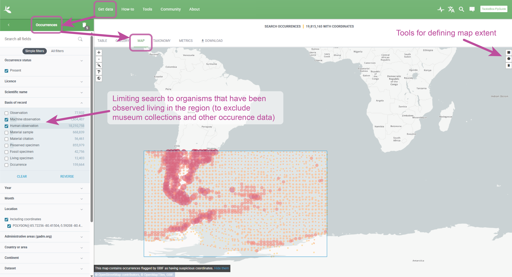
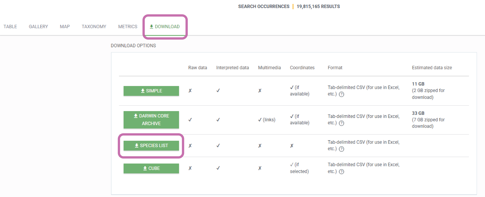

# TackleBox: FlyGuide

<p align="center">
  
</p>

_Current module version: **1.3.0**_

**FlyGuide** is a TackleBox module for building region‑specific NCBI nucleotide
reference panels from GBIF downloads, with optional NCBI "coverage checks" via
GuideCheck.

It was designed for metagenomic and sedimentary ancient DNA (sedaDNA) work,
where you want regionally sensible references to pre‑map against (or to use as
BLAST databases) without hauling the entire nt database around.

---

## Overview

Given a GBIF occurrence or checklist download (CSV/TSV with `species`,
`genus`, and `kingdom` columns), FlyGuide:

1. Parses the GBIF file and builds:
   - a clean species/genus search list for NCBI,
   - a species↔kingdom mapping table.
2. Optionally runs **GuideCheck** to summarize what NCBI already has for each
   name (nuccore/SRA/assembly counts).
3. Uses `NCBI-NT_Downloader.pl` to fetch curated mitochondrial, plastid, and
   selected nuclear marker sequences from NCBI Nucleotide.
4. Splits the combined FASTA by kingdom and molecule type
   (mitochondrial / plastid / nuclear markers / other), with accession‑level
   de‑duplication.

Key outputs:

- `OUTPREFIX_species_search.txt`
- `OUTPREFIX_species_kingdom.tsv`
- `OUTPREFIX_ncbi_guidecheck.tsv` (if GuideCheck enabled)
- `OUTPREFIX.fasta` (combined NCBI records)
- `OUTPREFIX.<Kingdom>-<Type>.fasta` (per‑kingdom, per‑type FASTAs)

---

## Scripts in this module

- `flyguide.sh`
  Main wrapper that drives the full FlyGuide pipeline
  (GBIF prep → optional GuideCheck → NCBI download → splitting).

- `gbif_prep_from_csv.py`
  GBIF pre‑processor: reads a GBIF CSV/TSV and writes the search list plus
  species↔kingdom table.

- `NCBI-NT_Downloader.pl`
  Perl script that queries NCBI Nucleotide via E‑utilities and downloads a
  filtered FASTA (mitochondrial, plastid, and marker sequences), with a
  configurable **max records per taxon** (`--max-per-taxon`).

- `split_fasta_by_kingdom_organelle_simple.pl`
  Splits the combined FASTA into `<Kingdom>-<Type>` FASTAs using kingdom
  information from the GBIF prep step and simple header‑based heuristics for
  molecule type; also handles accession‑level de‑duplication.

- `guidecheck.sh`
  Standalone NCBI "coverage check" tool for taxon lists. Used optionally by
  `flyguide.sh` when `--guidecheck` is enabled, but can also be run on its own.

- `gbifSpeciesList_NCBIDownloader_KingdomSort.sh`
  Legacy convenience wrapper that runs GBIF prep → NCBI download → splitting
  in one go. Mostly superseded by `flyguide.sh` but kept for backwards
  compatibility.

- `regions_config.tsv`
  Optional configuration file defining marker regions, classes, and the NCBI
  `[Title]` clauses used by `NCBI-NT_Downloader.pl`.

---

## Dependencies

- bash
- Python 3.7+ (for `gbif_prep_from_csv.py` and `guidecheck.sh`)
- Perl 5.x with `Bio::DB::EUtilities` (for `NCBI-NT_Downloader.pl`)
- `curl`, `jq` (for `guidecheck.sh`)
- Internet access to NCBI E‑utilities

An NCBI API key is strongly recommended for higher rate limits.

---

## Quickstart (recommended: `flyguide.sh`)

1. Export a GBIF CSV/TSV for your region (see **Preparing GBIF downloads**).
2. From the directory with your GBIF file, run:

```bash
# Fast path: GuideCheck OFF (default)
 /path/to/TackleBox/flyguide/flyguide.sh \
   RegionX_GBIF.csv \
   RegionX_refs \
   your.email@example.org \
   YOUR_NCBI_API_KEY
```

To **enable GuideCheck** (adds an NCBI coverage summary TSV, more API calls):

```bash
 /path/to/TackleBox/flyguide/flyguide.sh --guidecheck \
   RegionX_GBIF.csv \
   RegionX_refs \
   your.email@example.org \
   YOUR_NCBI_API_KEY
```

This will:

- Build `RegionX_refs_species_search.txt`
- Build `RegionX_refs_species_kingdom.tsv`
- Optionally build `RegionX_refs_ncbi_guidecheck.tsv`
- Download NCBI nucleotide records into `RegionX_refs.fasta`
- Split that FASTA into per‑kingdom/per‑type FASTAs:

  ```text
  RegionX_refs.Animal-Mito.fasta
  RegionX_refs.Plant-Plastid.fasta
  RegionX_refs.Fungi-NucMark.fasta
  RegionX_refs.Unknown-Other.fasta
  ...
  ```

---

## Alternative wrapper: `gbifSpeciesList_NCBIDownloader_KingdomSort.sh`

For historical reasons, FlyGuide also includes an older wrapper that does the
same three logical steps (GBIF prep → NCBI download → splitting) in one shot:

```bash
/path/to/TackleBox/flyguide/gbifSpeciesList_NCBIDownloader_KingdomSort.sh \
  RegionX_GBIF.csv \
  RegionX_refs \
  your.email@example.org \
  YOUR_NCBI_API_KEY
```

This wrapper:

- Calls `gbif_prep_from_csv.py`
- Calls `NCBI-NT_Downloader.pl`
- Calls `split_fasta_by_kingdom_organelle_simple.pl`

It is still usable, but most users should prefer **`flyguide.sh`**, which
adds optional GuideCheck and some better logging/argument handling.

---

## Preparing GBIF downloads

FlyGuide expects a GBIF CSV/TSV that includes at least `species`, `genus`, and
`kingdom` columns.

The GBIF web interface can change over time, but a typical workflow is:

1. Go to https://www.gbif.org/ and log in.
2. Use the map to zoom to your study region and apply a **geographic filter**
   (e.g. polygon or bounding box).
   
3. Add **taxonomic filters** if desired (e.g. only `Plantae` + `Animalia`).
4. Choose an **"Occurrence"** or **"Checklist"** download that includes
   taxonomic fields.
   
5. Start the download and wait for the ZIP to be ready.
6. Unzip the download; identify the main occurrence/checklist file
   (often a `.csv` or `.tsv`).
7. Confirm that it contains `species`, `genus`, and `kingdom` columns
   (case‑insensitive).

---

## What `gbif_prep_from_csv.py` produces

The GBIF prep step takes your GBIF CSV/TSV and writes two files:

- `OUTPREFIX_species_search.txt`
  A de‑duplicated list of names to query in NCBI:
  - all distinct `species` names,
  - plus `genus` names where `species` is empty.

- `OUTPREFIX_species_kingdom.tsv`
  A two‑column TSV of `species` ↔ `kingdom` pairs used later for splitting.

These live in the same directory where you ran `flyguide.sh`.

---

## NCBI downloader: regions and `--max-per-taxon`

### Target regions (genes and genomes)

FlyGuide is designed to pull **organelle** and **selected marker** sequences from
NCBI’s nucleotide database (`nuccore`) for each taxon in your GBIF list.

For each taxon (or `txid`), `NCBI-NT_Downloader.pl` builds an NCBI query of the form:

- `(Genus species[ORGN])`
- `AND 50:400000[SLEN]`
- `AND (`
  - `mitochondrion OR mitochondrial OR chloroplast OR plastid`
  - `OR <marker Title clauses>`
- `)`
- `NOT wgs[PROP]`
- `NOT tsa[PROP]`
- `NOT clone[Title]`
- `NOT UNVERIFIED[Title]`
- `NOT chromosome[Title]`
- `NOT PREDICTED[Title]`

This means, by default, FlyGuide will retrieve:

- **Mitochondrial sequences**
  - Complete mitogenomes
  - Single mitochondrial genes (e.g. COI, cytb) when they are annotated with
    `mitochondrion` / `mitochondrial` in the record.
- **Plastid/chloroplast sequences**
  - Complete plastomes
  - Single plastid genes (e.g. rbcL, matK) when annotated with
    `chloroplast` / `plastid` / `plastome`.
- **Nuclear ribosomal / marker sequences** (when `regions_config.tsv` is not found)
  - 18S rRNA (SSU)
  - 28S rRNA (LSU)
  - ITS1, ITS2, 5.8S
  - histone H3

These nuclear markers are matched via `[Title]` terms while still applying the
same length and filtering constraints (`50–400,000 bp`, no WGS/TSA/clone/UNVERIFIED/
chromosome/PREDICTED).

So **yes**: both full organelle genomes and single organelle genes are retrieved
under the default settings.

### Configurable marker set: `regions_config.tsv`

The behaviour above can be customised via a small tab‑separated file:

- `regions_config.tsv` (located alongside the FlyGuide scripts)

Each row describes a “region” (marker or group of markers):

```text
region_id   class     enabled_default  regex                                      ncbi_title_clause
MITO        Mito      1                mitochondrion|mitochondrial|\[location=mitochondrion\]
PLASTID     Plastid   1                chloroplast|plastid|plastome|\[location=(chloroplast|plastid)\]
NUCRDNA_18S NucMark   1                \b18S(\s+ribosomal\s+RNA|\s+rRNA)?\b|...   "18S ribosomal RNA"[Title] OR ...
...
COI         Mito      0                \bCOI\b|\bCO1\b|\bcox1\b|\bCOX1\b          COI[Title] OR CO1[Title] OR ...
OTHER       Other     1                .*
```

Columns:

- `region_id`
  Short name for the region (e.g. `COI`, `NUCRDNA_ITS`).

- `class`
  High‑level category used conceptually for that region:
  - `Mito`    – mitochondrial regions
  - `Plastid` – plastid/chloroplast regions
  - `NucMark` – nuclear markers (e.g. rDNA, H3)
  - `Other`   – everything else

- `enabled_default`
  - `1` = region is **active by default**
  - `0` = region is defined but **off by default** (opt‑in)

- `regex`
  Case‑insensitive regular expression you may use for classifying FASTA
  headers downstream (currently the splitter uses built‑in heuristics; see
  below, but the config file is designed to keep future class definitions in
  one place).

- `ncbi_title_clause`
  Optional NCBI `[Title]` search clause used to build the **marker block** in
  the downloader query. Any row with `enabled_default != 0` and a non‑empty
  `ncbi_title_clause` contributes to the marker part of the query.

At startup, `NCBI-NT_Downloader.pl`:

1. Tries to read `regions_config.tsv`.
2. Collects every row where:
   - `enabled_default != 0`, and
   - `ncbi_title_clause` is non‑empty.
3. Joins these into a marker block, e.g.:

   ```text
   ("18S ribosomal RNA"[Title] OR 18S[Title] OR ...) OR
   ("28S ribosomal RNA"[Title] OR 28S[Title] OR ...) OR
   ...
   ```

4. Inserts that marker block alongside the organelle block:

   ```text
   AND ( (mitochondrion OR mitochondrial OR chloroplast OR plastid)
         OR (<all active marker clauses>) )
   ```

If `regions_config.tsv` is missing or provides no usable marker clauses, the
downloader falls back to a built‑in nuclear marker block that reproduces the
original behaviour (18S/28S/ITS/5.8S/H3).

### Controlling records per taxon: `--max-per-taxon`

By default, the downloader caps how many records it will pull per taxon:

- Default: **1000** records per species/taxid (configurable).

You can change this via the `--max-per-taxon` option when calling
`NCBI-NT_Downloader.pl` directly:

```bash
# Example: cap at 1500 records per taxon
perl NCBI-NT_Downloader.pl \
  Falklands_refs_species_search.txt \
  Falklands_refs \
  your.email@example.org \
  YOUR_NCBI_API_KEY \
  --max-per-taxon 1500
```

FlyGuide will then:

- ESearch up to `N` IDs for that taxon,
- EFETCH those IDs in one or more batches,
- Append the resulting FASTA records to `OUTPREFIX.fasta`.

If you do not specify `--max-per-taxon`, the default **1000** cap is used.

When calling via `flyguide.sh`, the downloader is invoked with its default
`--max-per-taxon` unless you edit `flyguide.sh` to pass a different value.

---

## Splitting, kingdoms, and de‑duplication

After downloading, FlyGuide uses `split_fasta_by_kingdom_organelle_simple.pl` to split
the combined FASTA into separate kingdom × type files:

- `OUTPREFIX.Animal-Mito.fasta`
- `OUTPREFIX.Plant-Plastid.fasta`
- `OUTPREFIX.Fungi-NucMark.fasta`
- `OUTPREFIX.Bacteria-Other.fasta`
- etc.

Key points:

- **Kingdom assignment** comes from the `OUTPREFIX_species_kingdom.tsv` produced
  by the GBIF prep step. Species‑level matches are used when available; if no
  match is found, entries fall back to `Unknown`.
- **Type assignment** (`Mito`, `Plastid`, `NucMark`, `Other`) currently uses
  simple header‑based heuristics:
  - `mitochondr` / `[location=mitochondrion]` → `Mito`
  - `chloroplast` / `plastid` / `plastome` or corresponding locations → `Plastid`
  - 18S/28S/SSU/LSU/ITS/5.8S/H3 → `NucMark`
  - otherwise → `Other`

  The `regions_config.tsv` file is designed so that future versions of the
  splitter can use its regex definitions directly, but the current release
  uses built‑in heuristics.

### De‑duplication behaviour

During splitting, FlyGuide also performs **accession‑level de‑duplication** to avoid
over‑representing identical records in the regional reference FASTAs.

Concretely:

- Each record’s accession is parsed from the first token in the FASTA header.
- A key of the form `Kingdom|Type|Accession` is tracked.
- If the same accession appears more than once for the same kingdom–type
  combination, only the **first occurrence is kept**; subsequent duplicates are
  skipped.
- A small summary is printed at the end of the splitter run, e.g.:

  ```text
  Total FASTA records read:    123456
  Total records written:       120321
  Total duplicate accessions:  3135 (skipped)
  ```

This means that within each output file (e.g. `Plant-Mito`, `Animal-NucMark`),
accessions are unique, which cuts down on redundant records while preserving
all distinct references across kingdoms/regions.

---

## Optional NCBI coverage check (“GuideCheck”)

FlyGuide also ships with an **optional helper script**:

- `guidecheck.sh` (referred to as **GuideCheck**)

GuideCheck lets you quickly check how much data NCBI has for each taxon in a
list, without actually downloading the sequences. It queries:

- NCBI **nuccore**
- NCBI **SRA**
- NCBI **assembly**

and summarises counts per taxon.

> By design, GuideCheck is **off by default** in `flyguide.sh`.
> It is an **opt‑in** step because it can be relatively slow on large taxon
> lists.

### Enabling GuideCheck inside FlyGuide

To turn it on, pass `--guidecheck` to `flyguide.sh`:

```bash
/path/to/TackleBox/flyguide/flyguide.sh --guidecheck \
  RegionX_GBIF.csv \
  RegionX_refs \
  your.email@example.org \
  YOUR_NCBI_API_KEY
```

This will:

- Run GuideCheck on `RegionX_refs_species_search.txt`
- Write `RegionX_refs_ncbi_guidecheck.tsv`

### GuideCheck as a standalone tool

You can also run `guidecheck.sh` directly with any taxa list:

```bash
# One taxon name per line in taxa.txt
bash guidecheck.sh -i taxa.txt -o taxa_ncbi_guidecheck.tsv --api-key YOUR_NCBI_API_KEY
```

The output TSV has columns:

- `query_name`
- `taxid`
- `matched_name`
- `rank`
- `nuccore`
- `sra`
- `assembly`
- `status`

The `status` field summarises availability:

- `NO_TAXID`
- `ASSEMBLY`
- `HAS_NUCCORE_AND_SRA`
- `SRA_ONLY`
- `NUCCORE_ONLY`
- `NONE`

You can use these counts/status labels to:

- Identify taxa that have **no or very sparse reference data** before running
  large FlyGuide downloads.
- Prioritise taxa or clades for **targeted sequencing** or curation.
- Document reference data completeness in the **Methods** or **Supplements**
  of downstream publications.

---

## Neotoma input mode (extinct and palaeo taxa)

FlyGuide can pull taxa directly from the [Neotoma Paleoecology Database](https://www.neotomadb.org/)
instead of (or in addition to) a GBIF download.  This is useful for building
reference panels that include **extinct** or **palaeoecological** taxa not
represented in GBIF.

The Neotoma module creates **occurrence-derived taxon buckets**, not definitive
biological range checklists.  A result means: *"a Neotoma occurrence exists for
this taxon in the requested spatial/temporal window."*  Many extinct subspecies
and old splitter names are collapsed to binomials for NCBI retrievability; the
original Neotoma names are preserved as metadata.

### New scripts

- `neotoma_extinct_to_gbif.py`
  Queries the Neotoma API by broad region, organism group, and time period and
  writes a GBIF-like CSV that the existing FlyGuide GBIF/NCBI pipeline can
  consume.  Standard-library only (no extra Python dependencies).

- `flyguide_neotoma.sh`
  Optional convenience wrapper: runs `neotoma_extinct_to_gbif.py` and then
  hands the resulting CSV straight to `flyguide.sh`.

- `README_NEOTOMA.md`
  Full documentation for the Neotoma module.

### Quick start

```bash
# List available region presets
python3 neotoma_extinct_to_gbif.py --list-regions

# List available time-period presets
python3 neotoma_extinct_to_gbif.py --list-periods

# Generate a GBIF-like CSV and then run FlyGuide manually
python3 neotoma_extinct_to_gbif.py \
  --region north_america \
  --period quaternary \
  --organisms animals \
  --status extinct \
  --out NA_quaternary_extinct_animals_neotoma_gbif.csv \
  --write-flyguide-files \
  --out-prefix NA_quaternary_extinct_animals

# Or use the wrapper to do both steps in one call
./flyguide_neotoma.sh \
  --region north_america \
  --period quaternary \
  --organisms animals \
  --status extinct \
  -- NA_quaternary_extinct_animals you@example.org YOUR_NCBI_API_KEY
```

### Example commands

```bash
# Northern Hemisphere Quaternary extinct animals
python3 neotoma_extinct_to_gbif.py \
  --region northern_hemisphere --period quaternary \
  --organisms animals --status extinct \
  --out NH_quaternary_extinct_animals.csv

# Holarctic Pleistocene extinct animals
python3 neotoma_extinct_to_gbif.py \
  --region holarctic --period pleistocene \
  --organisms animals --status extinct \
  --out holarctic_pleistocene_extinct_animals.csv

# North America Holocene plants
python3 neotoma_extinct_to_gbif.py \
  --region north_america --period holocene \
  --organisms plants --status all \
  --out NA_holocene_plants.csv

# Tanzania Quaternary all organisms
python3 neotoma_extinct_to_gbif.py \
  --region tanzania --period quaternary \
  --organisms all --status all \
  --out tanzania_quaternary_all.csv
```

> **Note:** For very broad queries (e.g. `--region northern_hemisphere
> --organisms all`), run `neotoma_extinct_to_gbif.py` alone first and inspect
> the CSV and `.rejected.tsv` before launching NCBI downloads.

### Name-mode options (new in v1.1.0)

`flyguide.sh` and `NCBI-NT_Downloader.pl` now support `--ncbi-name-mode` /
`--name-mode` to control how taxon names are normalised for NCBI `[ORGN]`
queries:

| Mode | Behaviour | Example |
|---|---|---|
| `species` (default) | Collapse to first two tokens | `Bison bison antiquus` → `Bison bison` |
| `trinomial` | Keep up to three tokens | `Bison bison antiquus` → `Bison bison antiquus` |
| `as-is` | Use name as-is after whitespace cleanup | `Bison bison antiquus` → `Bison bison antiquus` |

The default (`species`) favours NCBI retrievability — many extinct subspecies
and splitter names are not in NCBI as trinomials.  Original Neotoma names are
always preserved in the CSV metadata columns (`neotoma_taxonname`).

---

## Additional palaeo sources: PBDB and NOW

### Why multiple palaeo databases?

No single database captures all taxa relevant to ancient DNA, sedaDNA,
environmental DNA, palaeoproteomics, or zooarchaeology work.  The three main
sources cover complementary niches:

| Source | Strengths | Limitations |
|---|---|---|
| **Neotoma** | Quaternary palaeoecology, pollen, vertebrates; rich metadata | Geographically uneven; strong NA bias; proxy/taxon biased |
| **PBDB** | Global fossil occurrences; broad geologic range; REST API | Coarser taxonomy; not just Quaternary |
| **NOW** | Cenozoic fossil mammals; good Eurasian/African coverage | Browser export only; no stable public REST API |

These modules create **occurrence-derived taxon buckets**, not authoritative
biological range checklists.  Many extinct names will not have NCBI entries;
some will be obsolete splitter taxa or subspecies.  That is acceptable — the
goal is a **large, transparent, deduplicated, NCBI-searchable candidate list**.
Original source names are always preserved in metadata for auditing.

### When to use each source

- **Neotoma** — Quaternary/Holocene, North America focus, pollen + vertebrates.
- **PBDB** — Global fossil coverage; supplement Neotoma for Eurasian/African
  taxa and broader geologic ranges.  Use the live REST API.
- **NOW** — Cenozoic mammals, especially Eurasia and Africa.  Export from the
  NOW browser UI and pass the file to `now_to_gbif.py`.
- **Merge all** — Use `flyguide_merge_palaeo_sources.py` to combine any
  combination of sources into one deduplicated FlyGuide-compatible CSV.

### PBDB module

```bash
# List region/period/organism presets
python3 pbdb_to_gbif.py --list-regions
python3 pbdb_to_gbif.py --list-periods
python3 pbdb_to_gbif.py --list-organisms

# Northern Hemisphere Quaternary animals
python3 pbdb_to_gbif.py \
  --region northern_hemisphere \
  --period quaternary \
  --organisms animals \
  --out NH_quaternary_animals_pbdb_gbif.csv \
  --write-flyguide-files

# Eurasian Pleistocene mammals
python3 pbdb_to_gbif.py \
  --region eurasia \
  --period pleistocene \
  --organisms mammals \
  --out Eurasia_pleistocene_mammals_pbdb_gbif.csv \
  --write-flyguide-files

# Tanzania Quaternary mammals (small live test)
python3 pbdb_to_gbif.py \
  --region tanzania \
  --period quaternary \
  --organisms mammals \
  --limit 100 \
  --out Tanzania_quaternary_mammals_pbdb_gbif.csv \
  --write-flyguide-files \
  --verbose
```

PBDB queries the [Paleobiology Database REST API](https://paleobiodb.org/data1.2)
directly.  Responses are cached in `.pbdb_cache/` by default.

### NOW module

NOW does not expose a stable public REST API equivalent to PBDB.  The
recommended workflow is to export data from the
[NOW browser interface](https://nowdatabase.luomus.fi/) and pass the file to
`now_to_gbif.py`.

```bash
# List available presets
python3 now_to_gbif.py --list-regions
python3 now_to_gbif.py --list-periods
python3 now_to_gbif.py --explain-now-export   # export instructions

# Import a NOW export and write FlyGuide files
python3 now_to_gbif.py \
  --input NOW_export.csv \
  --region eurasia \
  --period quaternary \
  --out Eurasia_quaternary_mammals_now_gbif.csv \
  --write-flyguide-files
```

### One-command wrapper

`flyguide_palaeo_sources.py` runs Neotoma + PBDB (+ optional NOW) in a single
call and merges the result automatically.  All sources use the same region /
period / organism vocabulary.

```bash
# List what's available
python3 flyguide_palaeo_sources.py --list-regions
python3 flyguide_palaeo_sources.py --list-periods
python3 flyguide_palaeo_sources.py --list-organisms

# Northern Hemisphere Quaternary animals (default settings)
python3 flyguide_palaeo_sources.py --out-prefix NH_quat_palaeo

# Eurasian Pleistocene mammals
python3 flyguide_palaeo_sources.py \
  --region eurasia --period pleistocene --organisms mammals \
  --out-prefix Eurasia_pleis_mammals

# As above, plus a pre-exported NOW table
python3 flyguide_palaeo_sources.py \
  --region eurasia --period pleistocene --organisms mammals \
  --now-input NOW_export.csv \
  --out-prefix Eurasia_pleis_mammals

# Chain straight into NCBI download (skip stopping to inspect the CSV first)
python3 flyguide_palaeo_sources.py \
  --region north_america --period quaternary --organisms animals \
  --out-prefix NA_quat_palaeo \
  --run-flyguide your@email.org YOUR_NCBI_API_KEY

# Smoke test with a small PBDB limit before running large queries
python3 flyguide_palaeo_sources.py \
  --region tanzania --period quaternary --organisms mammals \
  --limit 200 --out-prefix test_smoke
```

**Organism mapping note:** Neotoma uses broad dataset-type categories, not
taxonomic clades. When you specify `--organisms mammals`, `birds`, `vertebrates`,
etc., those are queried precisely in PBDB but broadened to `animals` for
Neotoma (which covers all vertebrate fauna under that category anyway).  The
wrapper tells you when this translation happens.

### Merging palaeo sources

```bash
# Combine Neotoma + PBDB + NOW into one deduplicated list
python3 flyguide_merge_palaeo_sources.py \
  --inputs \
    NH_quaternary_extinct_animals_neotoma_gbif.csv \
    NH_quaternary_animals_pbdb_gbif.csv \
    Eurasia_quaternary_mammals_now_gbif.csv \
  --collapse binomial \
  --out NH_quaternary_palaeo_merged_gbif.csv \
  --write-flyguide-files \
  --out-prefix NH_quaternary_palaeo_merged

# Then run FlyGuide on the merged list
./flyguide.sh \
  NH_quaternary_palaeo_merged_gbif.csv \
  NH_quaternary_palaeo_refs \
  your_email@example.org \
  YOUR_NCBI_API_KEY
```

> **Note on Quaternary focus:** Ancient DNA is almost exclusively Quaternary
> (Pleistocene/Holocene, roughly 0–2.58 Ma).  Older intervals (Pliocene,
> Miocene, Cenozoic) remain available for palaeoproteomics or exploratory use
> but are not the primary target.

See `README_PBDB_NOW.md` for full documentation.

---

## Live GBIF queries from the command line

`gbif_query.py` lets you build FlyGuide species lists directly from the GBIF
occurrence API — no website visit or GBIF account required.  Specify a taxon
group and a geographic area; the tool queries the GBIF REST API, resolves
species names, and writes a GBIF-like CSV that feeds straight into the rest of
the FlyGuide pipeline.

Key features:

- **25+ taxon group presets** — mammals, birds, fish, insects, vascular plants, …
  Plus any scientific name or numeric GBIF key.
- **35+ geographic presets** — continental regions, individual countries,
  multi-continent OR queries, and **ocean basin bounding boxes** for marine taxa
  outside national boundaries.
- **Basis-of-record filtering** — human observations, museum specimens, fossils,
  machine observations, or any combination.
- **Automatic facet chunking** — transparently handles queries that exceed GBIF's
  10 000-species facet cap by chunking across taxonomic orders.
- **Disk caching** — first run resolves names; all subsequent runs are instant.
- **Standard-library only** — no pip installs required.

### Quick examples

```bash
# Northern hemisphere mammals, human observations
python3 gbif_query.py \
  --taxon mammals \
  --region northern_hemisphere \
  --basis human \
  --out NH_mammals_gbif.csv \
  --write-flyguide-files

# Vascular plants from Canada
python3 gbif_query.py \
  --taxon vascular_plants \
  --country CA \
  --out canada_plants_gbif.csv

# Birds across the holarctic (multi-continent, OR'd)
python3 gbif_query.py \
  --taxon birds \
  --continent northern_hemisphere \
  --basis human \
  --out holarctic_birds_gbif.csv

# Sharks and rays in the North Atlantic (open ocean included)
python3 gbif_query.py \
  --taxon chondrichthyes \
  --region north_atlantic \
  --out NAtlantic_sharks_gbif.csv

# Cetacea globally (covers high seas — no country filter needed)
python3 gbif_query.py \
  --taxon cetacea \
  --region global \
  --out global_cetacea_gbif.csv \
  --write-flyguide-files

# Custom taxon by scientific name
python3 gbif_query.py \
  --taxon Bovidae \
  --region africa \
  --out africa_bovidae_gbif.csv

# List all presets
python3 gbif_query.py --list-taxon-groups
python3 gbif_query.py --list-regions
python3 gbif_query.py --list-basis
```

### Marine and high-seas taxa

Records in international waters carry no country code in GBIF.  To capture them,
use one of the ocean basin region presets (no country filter is applied):

```bash
# Indian Ocean cetaceans
python3 gbif_query.py --taxon cetacea --region indian_ocean --out indian_ocean_cetacea.csv

# Southern Ocean seabirds
python3 gbif_query.py --taxon birds --region southern_ocean --out southern_ocean_birds.csv
```

Available ocean presets: `north_atlantic`, `south_atlantic`, `atlantic`,
`north_pacific`, `north_pacific_east`, `south_pacific`, `indian_ocean`,
`southern_ocean`, `arctic_ocean`, `mediterranean`, `caribbean`, `coral_triangle`.

### Combining GBIF with palaeo sources

The output CSV format is identical to the palaeo exporter outputs, so you can
merge extant and extinct species lists in one step:

```bash
python3 gbif_query.py \
  --taxon mammals --region north_america --basis human \
  --out NA_mammals_extant_gbif.csv

python3 neotoma_extinct_to_gbif.py \
  --region north_america --period quaternary --organisms animals --status extinct \
  --out NA_mammals_extinct_neotoma_gbif.csv

python3 flyguide_merge_palaeo_sources.py \
  --inputs NA_mammals_extant_gbif.csv NA_mammals_extinct_neotoma_gbif.csv \
  --out NA_mammals_complete_gbif.csv \
  --write-flyguide-files --out-prefix NA_mammals_complete

./flyguide.sh NA_mammals_complete_gbif.csv NA_mammals_refs your@email.org YOUR_API_KEY
```

See `README_GBIF.md` for full documentation, a flag reference, and a step-by-step
tutorial.

---

## Repository layout (within TackleBox)

If FlyGuide lives inside a larger TackleBox repository, a typical structure is:

```text
TackleBox/
  flyguide/
    flyguide.sh
    gbif_prep_from_csv.py
    NCBI-NT_Downloader.pl
    split_fasta_by_kingdom_organelle_simple.pl
    guidecheck.sh
    gbifSpeciesList_NCBIDownloader_KingdomSort.sh
    regions_config.tsv
    README.md
    gbif_query.py                  # GBIF live-API query tool
    neotoma_extinct_to_gbif.py     # Neotoma live-API exporter
    flyguide_neotoma.sh            # Neotoma convenience wrapper
    pbdb_to_gbif.py                # PBDB live-API exporter
    now_to_gbif.py                 # NOW table importer
    flyguide_merge_palaeo_sources.py  # Multi-source deduplication merger
    flyguide_palaeo_sources.py      # One-command all-sources wrapper
    _palaeo_tui.py                 # Shared TUI progress helpers
    README_NEOTOMA.md
    README_PBDB_NOW.md
    README_GBIF.md
    TUTORIAL.md                    # end-to-end worked examples
  spinner/        # (planned) module for reference filtering / regional DB tidy
  flyforge/       # (planned) bait design module for RNA/DNA baits
  catchtofillet/  # (planned) metagenomic classification module
  README.md       # high-level TackleBox overview
  LICENSE
```

---

## Versioning and citation

For reproducibility in publications:

- Tag releases in Git (e.g. `v1.0.0`) once a configuration is stable.
- In manuscripts, cite both:
  - The TackleBox/FlyGuide paper (when available), and
  - The specific Git tag or commit hash used.

Example citation text (to be adapted once a DOI exists):

> TackleBox: FlyGuide v1.0.0 — a GBIF‑driven NCBI reference builder for
> metagenomic and sedimentary ancient DNA studies. Available at:
> https://github.com/USER/TackleBox (commit `abcdef1`).

