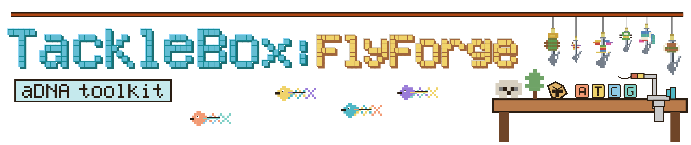

# TackleBox: FlyForge

<p align="center">
  
</p>

**FlyForge** is a bait/probe designer for hybridization capture enrichment with integrated support for **in-house RNA bait synthesis from DNA oligo pools**. It is built for both focused projects (for example, single mitogenomes or locus panels) and larger multi-target panels.

FlyForge is part of the **TackleBox** suite.

## What FlyForge does

- tiles probes at a user-defined density
- preprocesses references (`U -> T`, short `N` runs -> `T`, optional repeat soft-masking)
- optionally removes complementary regions from the input references in the CARPDM style
- filters probes by ambiguity, masked fraction, Tm, internal LguI/BspQI sites, perfect reverse complements, BLAST off-targets, self-BLAST redundancy, and `cd-hit-est` clustering
- constructs **order-ready oligo-pool sequences** for in-house synthesis
- validates the final bare bait set back against the input references with per-target coverage plots and summary tables

## Oligo-pool design model

FlyForge follows the CARPDM oligo-pool strategy for in-house synthesis of RNA baits.

### Final oligo structure

```text
5'-GCTAATACGACTCACTATAGGG [probe] [reverse-complement of amplification primer]-3'
```

Where:

- `GCTAATACGACTCACTATAGGG` is the **22 nt T7 promoter-containing primer sequence** used in CARPDM
- the selected amplification primer is always designed to end in `GCTCTTCG`
- therefore its reverse complement begins with `CGAAGAGC`, producing the intended CARPDM-compatible BspQI/LguI-associated tail on the final oligo

### Wet-lab logic

The intended molecular workflow is:

1. PCR amplify the oligo pool
2. digest with **LguI / BspQI** to generate the correct transcription template boundary
3. perform **T7 in vitro transcription**
4. purify the RNA bait pool

## Requirements

### Python

- Python 3.8+
- `biopython`
- `primer3-py`
- `matplotlib`
- `seaborn`
- `pandas`
- `numpy`
- `tqdm`

### External tools

- **BLAST+** (`blastn`, `makeblastdb`)
- **CD-HIT** (`cd-hit-est`)

## Installation

```bash
conda create -n flyforge python=3.12
conda activate flyforge
conda install -c bioconda blast cd-hit
pip install biopython primer3-py matplotlib seaborn pandas numpy tqdm

chmod +x FlyForge.py FlyForge FlyForgeAudit.py FlyForgeAudit
```

## Quick start

### Standard FlyForge design

```bash
FlyForge \
  -i reference.fasta \
  --prefix my_panel \
  --output-dir flyforge_output \
  --bait-length 80 \
  --tiling-density 4 \
  --min-tm 50 \
  --threads 8
```

### Standard design with a custom exclusion database

```bash
FlyForge \
  -i targets/*.fasta \
  --prefix env_panel \
  --output-dir flyforge_output \
  --bait-length 80 \
  --tiling-density 3 \
  --min-tm 50 \
  --remove-complements \
  --blast-db /path/to/exclusion_db \
  --blast-min-pident 80 \
  --blast-max-hits 5 \
  --threads 16
```

### Skip oligo-pool construction

```bash
FlyForge \
  -i reference.fasta \
  --prefix bare_probes_only \
  --no-opool
```

## Core outputs

A typical run produces:

- `PREFIX_final_baits.fa` — final bare bait sequences
- `PREFIX_probes.fna` — bare bait FASTA used for validation and QC
- `PREFIX_oligo_pool.fna` — full order-ready oligo sequences
- `PREFIX_amplification_primers.fna` — T7 primer and selected second primer
- `PREFIX_final_blast.xml` — validation BLAST output
- `PREFIX_target_info.csv` — per-target validation metrics
- `PREFIX_probe_info.csv` — per-probe QC metrics
- `PREFIX_target_probe_pairs.csv` — target:probe pairings from validation BLAST
- `PREFIX_per_ref_stats.tsv` — per-reference bait counts plus **final validated** coverage statistics
- `PREFIX_summary.tsv` — parameters and step-wise run summary
- `PREFIX_plots/` — violin plots and individual target coverage plots
- `PREFIX_progress.log` — log of the full run

## Important behavior in this version

### Validation BLAST

FlyForge validates the final bare probes against the input references with BLAST using `-dust no` and `-soft_masking false`. This avoids undercounting valid probe hits in low-complexity regions during the post-design validation step.

### O-pool failure behavior

FlyForge now **fails loudly** if it cannot identify a valid second amplification primer or if primer-selection BLAST output cannot be parsed. That is deliberate: a failed o-pool design should not silently produce something that could be mistaken for an order-ready synthesis file.

## Recommended use patterns

### Single-organism ancient DNA or degraded DNA capture

```bash
FlyForge \
  -i reference.fasta \
  --prefix my_species \
  --bait-length 80 \
  --tiling-density 4 \
  --min-tm 50 \
  --remove-complements \
  --threads 8
```

### Multi-species or environmental panel design

```bash
FlyForge \
  -i targets/*.fasta \
  --prefix multi_taxon_panel \
  --bait-length 80 \
  --tiling-density 3 \
  --min-tm 50 \
  --remove-complements \
  --blast-db /path/to/exclusion_db \
  --blast-min-pident 80 \
  --blast-max-hits 5 \
  --cluster-identity 0.95 \
  --threads 16
```

## Companion module: FlyForgeAudit

This repository now also includes **FlyForgeAudit**, a companion module for:

- auditing an existing bait set against one or more references
- screening a panel against an avoid database
- designing the **minimal spike-in bait set** needed to extend an existing panel to new organisms

See `FlyForgeAudit_README.md` for full documentation.

## Citation

If you use FlyForge, cite this software and the CARPDM publication that established the in-house oligo-pool synthesis strategy.
